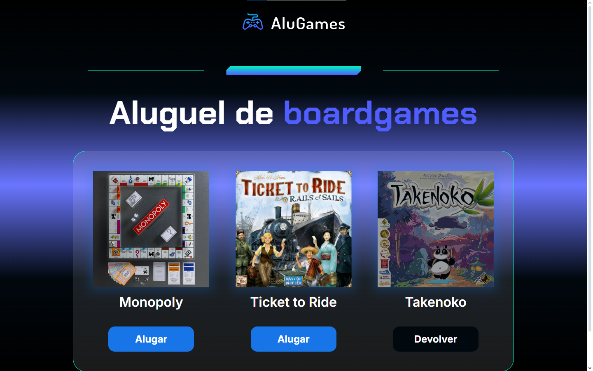

# AluGames

Este é um projeto de um sistema de aluguel de jogos de tabuleiro. O usuário pode alugar e devolver jogos, alterando o estado do botão e a aparência visual do jogo.

## Demonstração

## Funcionalidades

- Alugar um jogo disponível.
- Devolver um jogo alugado.
- Alteração visual para indicar o estado do jogo (alugado ou disponível).

## Tecnologias Utilizadas

- **HTML5**: Para estruturar o conteúdo da página.
- **CSS3**: Para estilizar e tornar o design atraente e responsivo.
- **JavaScript**: Para a lógica do sistema de aluguel de jogos.

## Como executar o projeto

1. Clone o repositório para sua máquina local.

    git clone (https://github.com/Leandro-Rocha81/Alu-Games.git)

2. Abra o arquivo (https://alu-games-eight.vercel.app/#) no navegador.
3. Interaja com os botões de "Alugar" e "Devolver" para simular o sistema de aluguel.
4. Utilize o botão "Reiniciar" para resetar as interações e começar novamente.

## Melhorias Futuras

- Implementação de uma seção de histórico de aluguéis.
- Adicionar mais detalhes aos jogos, como descrições e categorias.
- Implementar filtros para facilitar a busca de jogos disponíveis.

## Contribuição

Contribuições são bem-vindas! Sinta-se à vontade para abrir uma *issue*, enviar um *pull request* com melhorias ou relatar problemas no repositório.

## Contato

Desenvolvido por Leandro Vitor Santos Rocha. Entre em contato em leandrocomercial81@gmail.com.
